# Kratos Admin UI

A modern, responsive admin interface for [Ory Kratos](https://www.ory.sh/kratos/) identity management system. Built with Next.js 14, Material-UI v7, and TypeScript.

> **🚨 SECURITY WARNING**: This interface should **NOT** be exposed to the public internet. It uses mock authentication for development purposes and is **NOT secure for production use**. Always deploy behind proper authentication and access controls.

> **⚠️ Development Phase**: This project is currently in active development. Features may change and breaking updates can occur. We encourage testing and feedback, but recommend caution for production use.

> **🔐 Authentication Module**: A secure authentication module is planned for future releases. Contributions are welcome! Until then, please ensure this interface is only accessible in secure, private environments.

> **🐛 Found an Issue?** Please [open an issue](https://github.com/dhia-gharsallaoui/kratos-admin-ui/issues) on GitHub. Your feedback helps improve the project!

## ✨ Features

### 🎯 Core Pages & Functionality

- **📊 Analytics Dashboard**: Comprehensive metrics dashboard with interactive charts displaying:
  - Total users and growth trends over 30 days
  - Active sessions and session analytics (last 7 days)
  - Email verification rates and patterns
  - Identity schema distribution analysis
  - System health monitoring with real-time status
- **👥 Identity Management**: Complete user identity lifecycle management:
  - **Create Identities**: Dynamic form generation based on Kratos schemas with real-time validation
  - **Browse Identities**: Clickable table with instant search, filtering, and smart pagination
  - **Identity Details**: Comprehensive identity view with all information:
    - Basic information (status, schema, timestamps)
    - User traits (email, username, personal info)
    - **Public Metadata**: JSON view of public metadata with syntax highlighting
    - **Admin Metadata**: JSON view of admin metadata with syntax highlighting
    - Identity-specific sessions with management capabilities
    - Raw JSON data view for debugging
  - **Edit Identities**: Full identity trait editing with real-time validation
  - **Delete Identities**: Safe deletion with confirmation dialogs
  - **Recovery Links**: Generate secure recovery links for password reset
  - **Bulk Session Management**: Delete all sessions for specific identities

- **🔐 Session Management**: Advanced session monitoring and control system:
  - **Session Overview**: Real-time session tracking with auto-search capabilities
  - **Session Details**: Comprehensive session information including:
    - Session metadata (ID, status, expiry, authentication methods)
    - Associated identity details and traits
    - Authentication methods and factors used
    - Device information and user agent details
    - Session activity and duration tracking
  - **Session Actions**:
    - Extend session expiry with custom durations
    - Revoke/disable sessions instantly
    - Real-time table updates after actions
  - **Advanced Search**: Auto-fetching search across all sessions with client-side filtering
  - **Identity-Specific Sessions**: View and manage sessions for individual users

- **📧 Message Monitoring**: Kratos courier message tracking and management:
  - **Message Overview**: Monitor all email and SMS messages sent through Kratos
  - **Message Details**: Comprehensive message information including:
    - Message content and templates
    - Delivery status and attempts
    - Error tracking and diagnostics
    - Dispatch information and timestamps
  - **Advanced Filtering**: Filter by status (queued, processing, sent, abandoned)
  - **Smart Search**: Auto-fetching search across recipient, subject, ID, template, and type
  - **Real-time Updates**: Live message status monitoring

- **📋 Schema Management**: Identity schema inspection and management:
  - View all configured identity schemas
  - Schema structure visualization with syntax highlighting
  - Schema properties and validation rules display
  - JSON schema validation and format details
  - Read-only schema browsing (creation via API not supported)

- **👤 User Profile**: User account management and preferences:
  - Profile information display
  - Role-based access control (Admin/Viewer)
  - Account settings and preferences
  - Theme switching (Light/Dark mode)

- **⚙️ Settings & Configuration**: Flexible endpoint configuration system:
  - Real-time Kratos endpoint configuration via UI
  - URL validation and error handling
  - Persistent settings stored in browser localStorage
  - Reset to defaults functionality

## 📸 Screenshots

### Dashboard Analytics

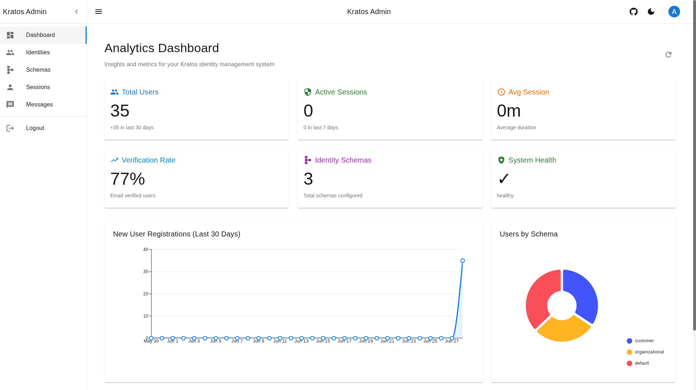
_Comprehensive analytics dashboard with real-time metrics and interactive charts_

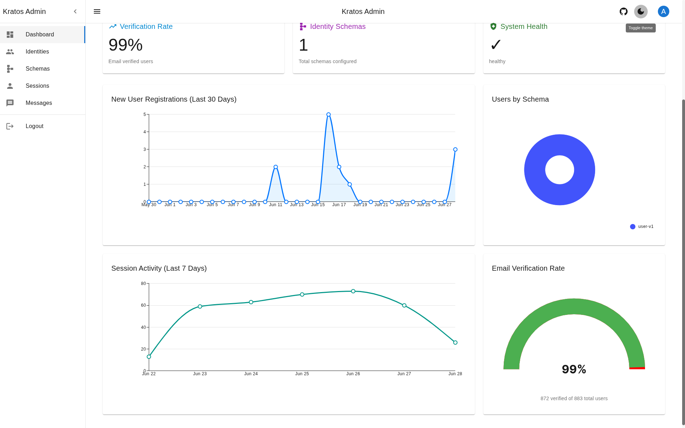
_Detailed system health monitoring and growth trend analysis_

### Identity Management

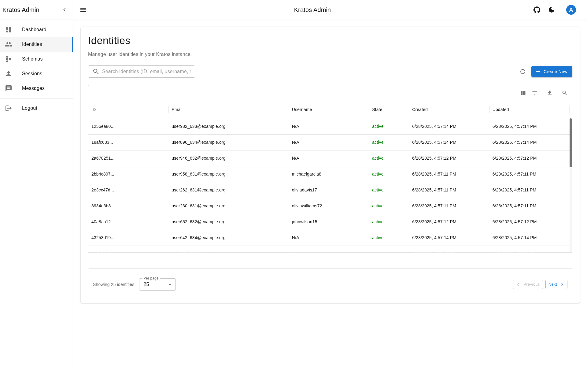
_Searchable identity table with clickable rows and advanced filtering_

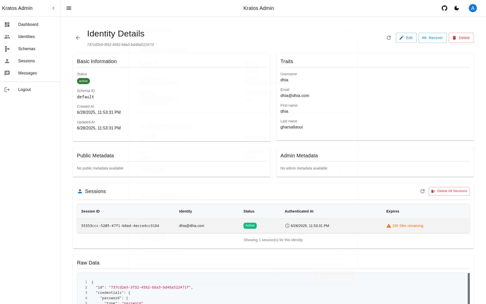
_Comprehensive identity view with traits, metadata, and session management_

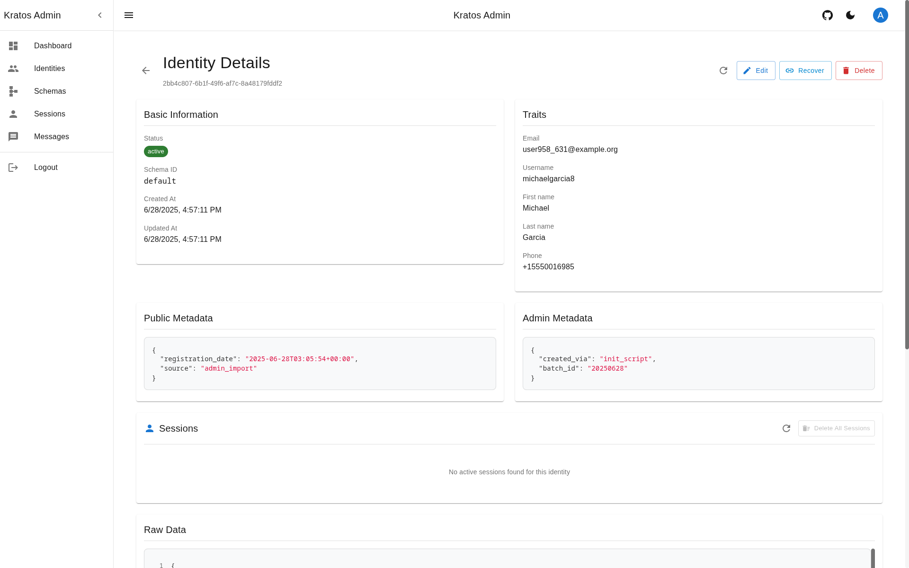
_Extended identity information with JSON metadata and syntax highlighting_

### Session Management

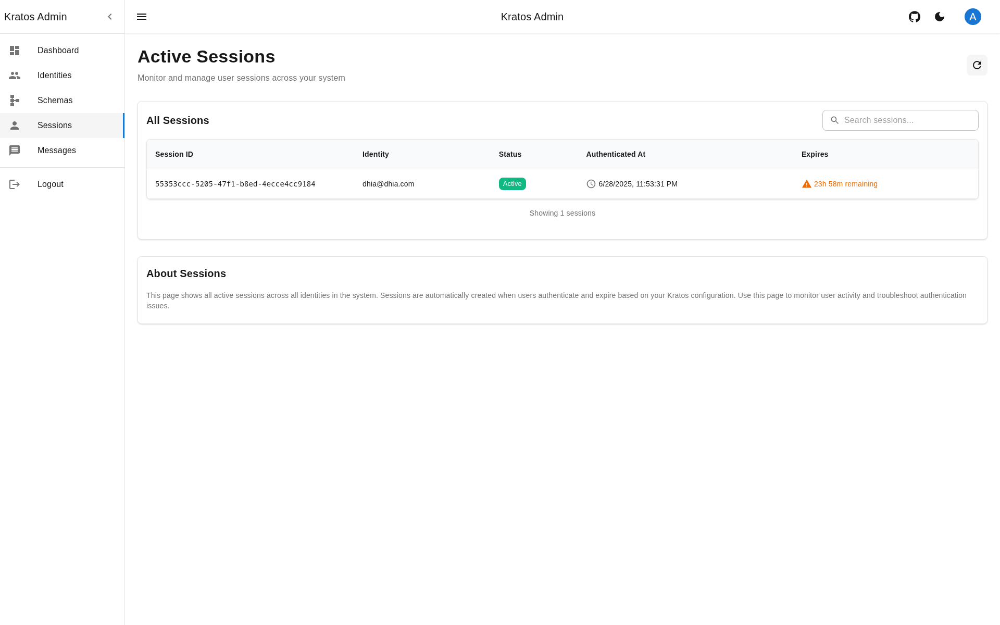
_Real-time session monitoring with auto-search capabilities_

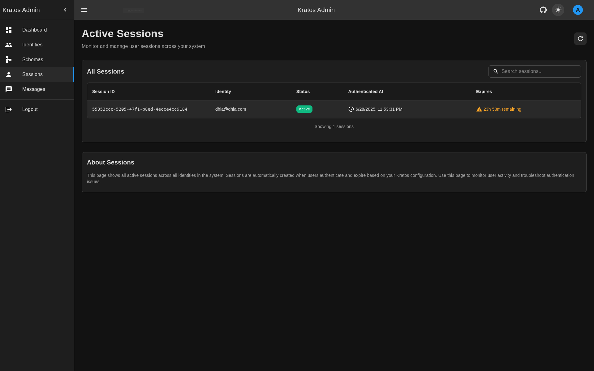
_Dark mode interface with seamless theme switching_

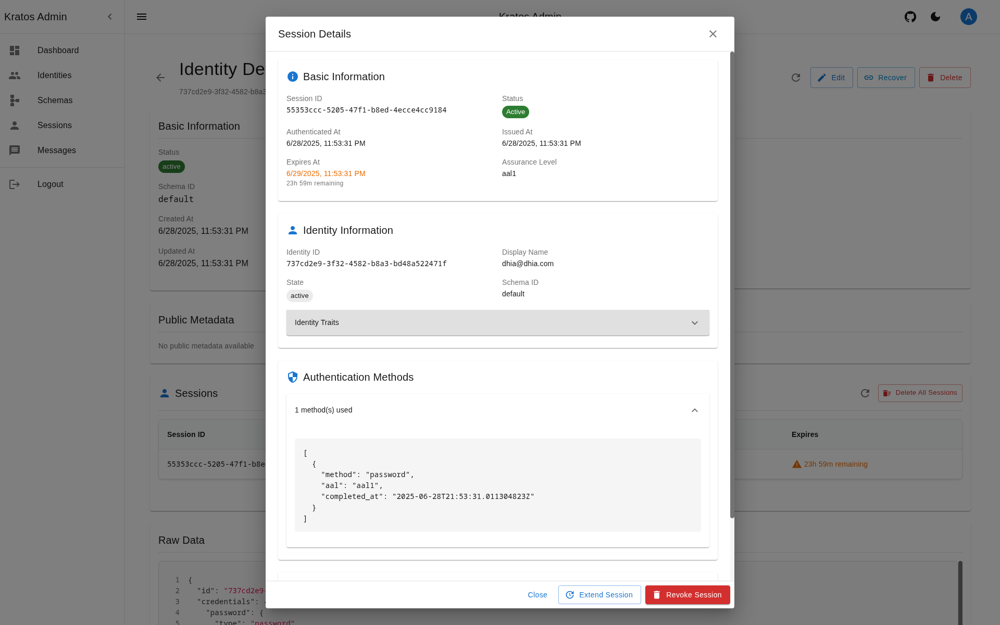
_Detailed session information with extend/revoke actions_

### Message Monitoring

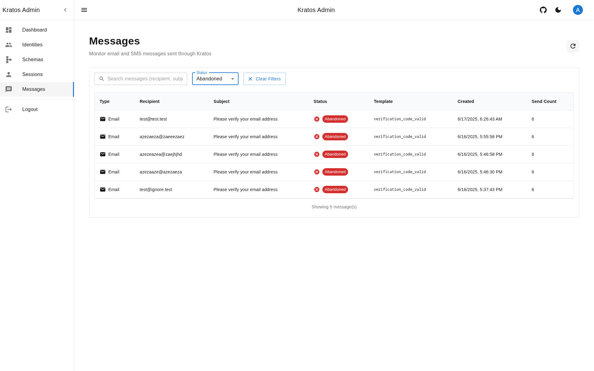
_Kratos courier message tracking with advanced filtering_

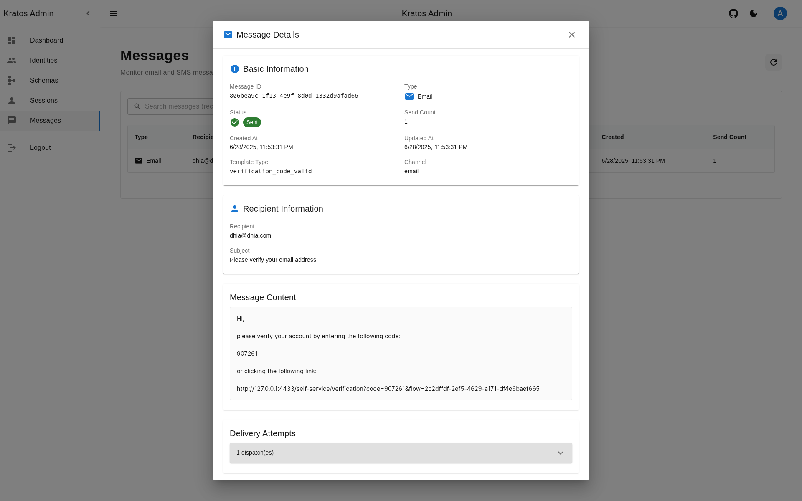
_Comprehensive message details with delivery status and error tracking_

### Schema Management

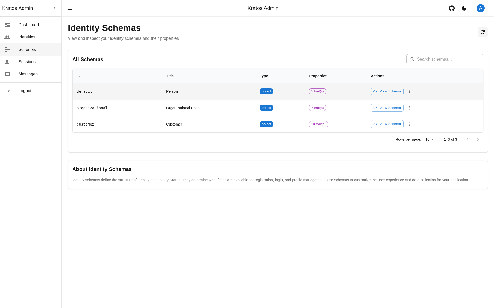
_Identity schema browsing and management interface_

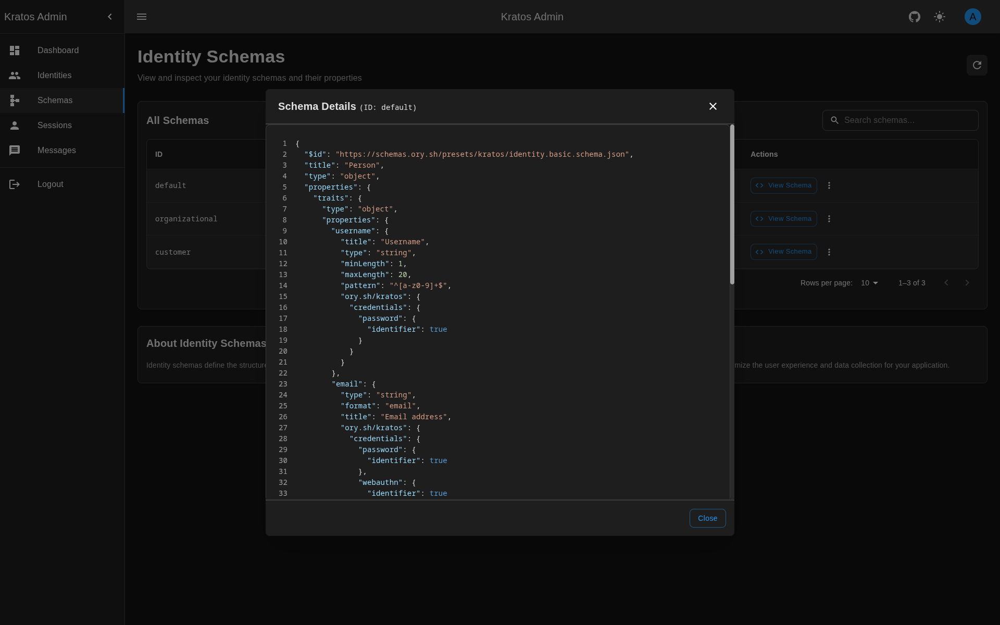
_JSON schema visualization with syntax highlighting and validation rules_

### Settings & Configuration

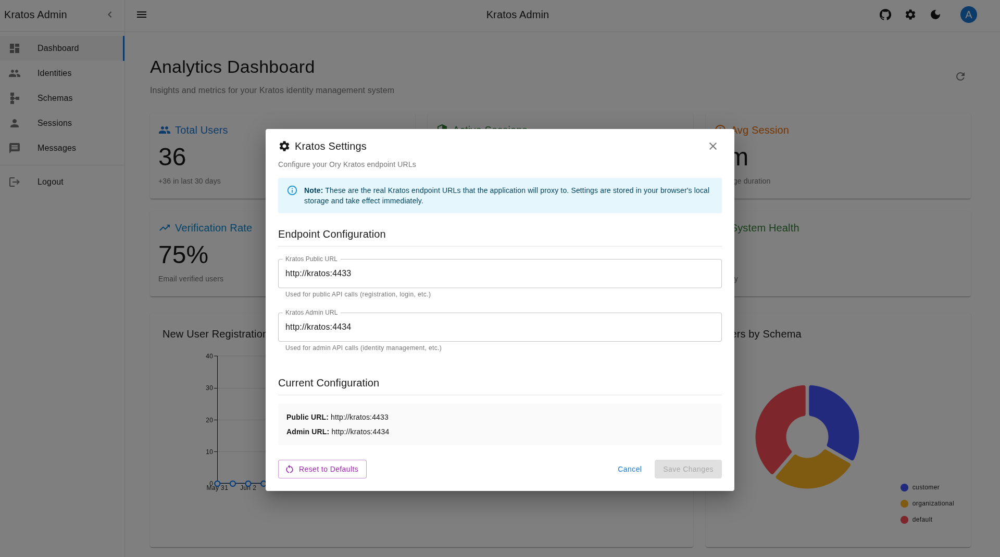
_Kratos endpoint configuration via the settings dialog with real-time validation_

### 🎨 User Experience

- **Modern UI**: Clean, professional interface with Material-UI v7 design system
- **Interactive Charts**: MUI X Charts for analytics visualization with real-time data
- **Advanced Search**: Multi-page auto-search with client-side filtering and debounced input
- **Clickable Interfaces**: Intuitive row-based navigation without cluttered action buttons
- **Visual Feedback**: Color-coded validation states, loading indicators, and status chips
- **Real-time Dialogs**: Modal dialogs with comprehensive details and immediate actions
- **Contextual Actions**: Smart action buttons that appear based on data availability
- **Loading States**: Skeleton loaders and dotted progress indicators for better perceived performance
- **Accessibility**: WCAG compliant components with keyboard navigation support
- **Dark/Light Mode**: Seamless theme switching with persistent preferences

## 🛠️ Technology Stack

- **Framework**: Next.js 14 (App Router)
- **UI Library**: Material-UI v7 + MUI X Charts/DataGrid
- **Forms**: React JSON Schema Form (RJSF) with custom Material-UI widgets
- **Validation**: libphonenumber-js for international phone numbers
- **State Management**: Zustand + TanStack Query
- **Language**: TypeScript
- **Styling**: Tailwind CSS + Emotion
- **API Client**: Ory Kratos Client (Identity, Session, Courier, Metadata APIs)
- **Syntax Highlighting**: React Syntax Highlighter with theme support
- **Authentication**: Custom auth system with persistent storage
- **Search**: Advanced auto-search with multi-page fetching and client-side filtering

## 📋 Prerequisites

- Node.js 22+ and npm
- Running Ory Kratos instance
- Docker (optional, for containerized deployment)

## 🚀 Quick Start

### Local Development

1. **Clone the repository**

   ```bash
   git clone https://github.com/dhia-gharsallaoui/kratos-admin-ui.git
   cd kratos-admin-ui
   ```

2. **Install dependencies**

   ```bash
   npm install
   ```

3. **Configure environment**

   ```bash
   # Create environment file
   cp .env.example .env.local

   # Edit with your Kratos URLs
   KRATOS_PUBLIC_URL=http://localhost:4433
   KRATOS_ADMIN_URL=http://localhost:4434
   ```

4. **Start development server**

   ```bash
   npm run dev
   ```

5. **Access the application**
   - Open [http://localhost:3000](http://localhost:3000)
   - Login with default credentials:
     - **Admin**: `admin` / `admin123`
     - **Viewer**: `viewer` / `viewer123`

### Docker

The pre-built Docker image is available on Docker Hub:

```bash
docker pull dhiagharsallaoui/kratos-admin-ui:latest
```

**Quick Start with Docker:**

```bash
docker run -p 3000:3000 \
  -e KRATOS_PUBLIC_URL=http://localhost:4433 \
  -e KRATOS_ADMIN_URL=http://localhost:4434 \
  dhiagharsallaoui/kratos-admin-ui:latest
```

### Docker Compose

```yaml
version: '3.8'
services:
  kratos-admin-ui:
    image: dhiagharsallaoui/kratos-admin-ui:latest
    ports:
      - '3000:3000'
    environment:
      - KRATOS_PUBLIC_URL=http://kratos:4433
      - KRATOS_ADMIN_URL=http://kratos:4434
    depends_on:
      - kratos
    networks:
      - kratos-network

  kratos:
    image: oryd/kratos:v1.0.0
    # ... your Kratos configuration
```

**Development Setup:**
For a complete development environment with Kratos, check the [`dev/`](./dev) folder which includes:

- Docker Compose with Kratos, self-service UI, and MailSlurper
- Multiple identity schemas (organizational, customer)
- Automated test data generation

## 📁 Project Structure

```
src/
├── app/                    # Next.js App Router pages
│   ├── (app)/             # Protected application routes
│   │   ├── dashboard/     # Analytics dashboard with interactive charts
│   │   ├── identities/    # Identity management with CRUD operations
│   │   │   ├── [id]/     # Individual identity details with metadata
│   │   │   └── create/   # Dynamic identity creation forms
│   │   ├── sessions/     # Session monitoring and management
│   │   ├── messages/     # Kratos courier message monitoring
│   │   ├── schemas/      # Schema management and visualization
│   │   └── profile/      # User profile and preferences
│   └── (auth)/           # Authentication pages
├── components/           # Shared UI components
│   ├── layout/          # Layout components (AdminLayout, Sidebar)
│   ├── navigation/      # Navigation and routing components
│   └── ui/              # Reusable UI components (loaders, dialogs)
├── features/            # Feature-based modules
│   ├── analytics/       # Dashboard analytics and charts
│   ├── auth/           # Authentication system and guards
│   ├── identities/     # Identity management (CRUD, search, metadata)
│   ├── sessions/       # Session management (monitoring, actions)
│   ├── messages/       # Message monitoring and tracking
│   └── schemas/        # Schema management and visualization
├── services/           # API services layer
│   └── kratos/         # Kratos API integration
│       └── endpoints/  # API endpoints (identities, sessions, courier)
├── providers/          # React context providers (Theme, Query, Auth)
└── styles/             # Global styles and themes
```

## 🎛️ Configuration

### Kratos Endpoint Configuration

You can configure Kratos endpoints in two ways:

#### 1. Via Settings Dialog (Recommended)

- Click the settings icon (⚙️) in the application header
- Enter your Kratos Public URL and Admin URL
- Settings are stored in browser localStorage and take effect immediately
- Supports both localhost URLs and remote endpoints

#### 2. Via Environment Variables

| Variable            | Description           | Default                 |
| ------------------- | --------------------- | ----------------------- |
| `KRATOS_PUBLIC_URL` | Kratos public API URL | `http://localhost:4433` |
| `KRATOS_ADMIN_URL`  | Kratos admin API URL  | `http://localhost:4434` |
| `BASE_PATH`         | Application base path | `/`                     |
| `NODE_ENV`          | Environment mode      | `development`           |

> **💡 Tip**: The settings dialog provides a more flexible way to configure endpoints without restarting the application.

### Authentication

The application uses a mock authentication system with predefined users:

- **Admin User**: Full access to all features
  - Username: `admin`
  - Password: `admin123`
- **Viewer User**: Read-only access
  - Username: `viewer`
  - Password: `viewer123`

### Kratos Integration

The application integrates with Kratos through multiple APIs:

- **Identity API**: Complete CRUD operations on user identities with trait management
- **Session API**: Comprehensive session monitoring, extension, and revocation
- **Courier API**: Email/SMS message tracking and delivery status monitoring
- **Metadata API**: System metadata, health checks, and configuration
- **Schema API**: Identity schema management and validation rules

## 📄 Available Pages & Routes

### Public Routes

- **`/login`** - Authentication page with role-based login (Admin/Viewer)

### Protected Routes (Admin Only)

- **`/dashboard`** - Analytics dashboard with comprehensive metrics and charts
- **`/identities`** - Identity management with searchable table and pagination
- **`/identities/create`** - Dynamic identity creation with schema-based forms
- **`/identities/[id]`** - Detailed identity view with:
  - Basic information and traits
  - Public and admin metadata with JSON highlighting
  - Identity-specific sessions management
  - Edit, delete, and recovery capabilities
- **`/sessions`** - Session monitoring and management with:
  - Real-time session tracking
  - Advanced auto-search capabilities
  - Session details with extend/revoke actions
- **`/messages`** - Kratos courier message monitoring with:
  - Email and SMS message tracking
  - Delivery status and error monitoring
  - Advanced filtering and search
- **`/schemas`** - Identity schema management and visualization
- **`/profile`** - User profile and account settings

### Key Features by Page

| Page             | Search | Actions                         | Real-time | Auto-fetch |
| ---------------- | ------ | ------------------------------- | --------- | ---------- |
| Dashboard        | ❌     | ❌                              | ✅        | ✅         |
| Identities       | ✅     | Edit, Delete, Recover           | ✅        | ✅         |
| Identity Details | ❌     | Edit, Delete, Recover, Sessions | ✅        | ❌         |
| Sessions         | ✅     | Extend, Revoke                  | ✅        | ✅         |
| Messages         | ✅     | View Details                    | ✅        | ✅         |
| Schemas          | ❌     | View Details                    | ❌        | ❌         |

## 🔧 Development

### Available Scripts

```bash
npm run dev          # Start development server
npm run build        # Build for production
npm run start        # Start production server
npm run lint         # Run ESLint
npm run format       # Format code with Prettier
```

### Code Quality

- **ESLint**: Configured with Next.js and TypeScript rules
- **Prettier**: Automatic code formatting
- **TypeScript**: Strict type checking enabled
- **Husky**: Git hooks for code quality (if configured)

### Architecture Principles

1. **Feature-Based Organization**: Code organized by business features
2. **Clean API Abstraction**: Services layer abstracts Kratos API complexity
3. **Smart Pagination**: Efficient data loading with automatic stopping
4. **Type Safety**: Comprehensive TypeScript coverage
5. **Performance First**: Optimized queries and caching strategies

## 📊 Analytics Features

### Dashboard Metrics

- **Identity Analytics**: Growth trends, schema distribution, verification status
- **Session Analytics**: Active sessions, usage patterns, duration metrics
- **System Health**: Real-time status monitoring

## 🐳 Production Deployment

### Docker Best Practices

- Multi-stage build for minimal image size
- Non-root user for security
- Health checks included
- Standalone Next.js output

### Kubernetes Example

```yaml
apiVersion: apps/v1
kind: Deployment
metadata:
  name: kratos-admin-ui
spec:
  replicas: 2
  selector:
    matchLabels:
      app: kratos-admin-ui
  template:
    metadata:
      labels:
        app: kratos-admin-ui
    spec:
      containers:
        - name: kratos-admin-ui
          image: dhiagharsallaoui/kratos-admin-ui:latest
          ports:
            - containerPort: 3000
          env:
            - name: KRATOS_PUBLIC_URL
              value: 'http://kratos:4433'
            - name: KRATOS_ADMIN_URL
              value: 'http://kratos:4434'
          resources:
            requests:
              memory: '128Mi'
              cpu: '100m'
            limits:
              memory: '256Mi'
              cpu: '200m'
```

**Runtime Configuration:**
The Docker image supports runtime configuration through environment variables, making it easy to deploy across different environments without rebuilding.

## 🤝 Contributing

1. Fork the repository
2. Create a feature branch: `git checkout -b feature/amazing-feature`
3. Commit changes: `git commit -m 'Add amazing feature'`
4. Push to branch: `git push origin feature/amazing-feature`
5. Open a Pull Request

### Development Guidelines

- Follow the existing code style
- Add TypeScript types for all new code
- Write tests for new features
- Update documentation as needed
- Run `npm run lint` and `npm run format` before committing

## 🔧 Troubleshooting

### Common Issues

1. **Kratos Connection Failed**
   - Use the settings dialog (⚙️ icon) to verify and update Kratos endpoint URLs
   - Check network connectivity between services
   - Ensure Kratos is running and accessible

2. **Authentication Issues**
   - Clear browser localStorage and try again
   - Verify user credentials match the configured users
   - Check browser console for errors

3. **Build Failures**
   - Run `npm ci` to clean install dependencies
   - Check Node.js version (18+ required)
   - Verify TypeScript errors with `npm run lint`

## 📄 License

This project is licensed under the MIT License - see the [LICENSE](LICENSE) file for details.

## 🙏 Acknowledgments

- [Ory Kratos](https://www.ory.sh/kratos/) for the excellent identity management system
- [dfoxg/kratos-admin-ui](https://github.com/dfoxg/kratos-admin-ui) for the original inspiration and foundational concepts
- [Next.js](https://nextjs.org/) team for the amazing React framework
- [Material-UI](https://mui.com/) for the beautiful component library
- [TanStack Query](https://tanstack.com/query) for state management
